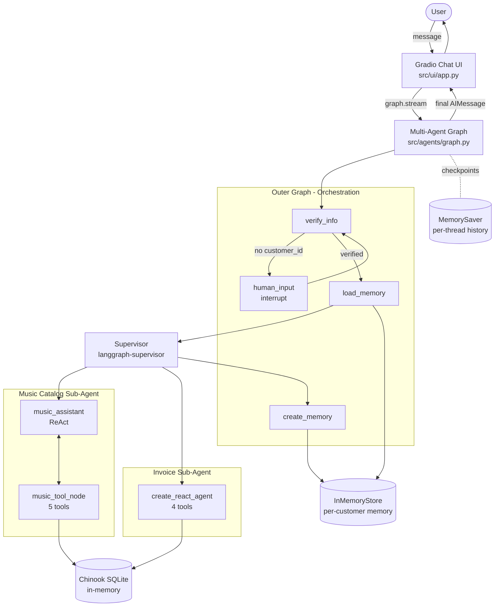
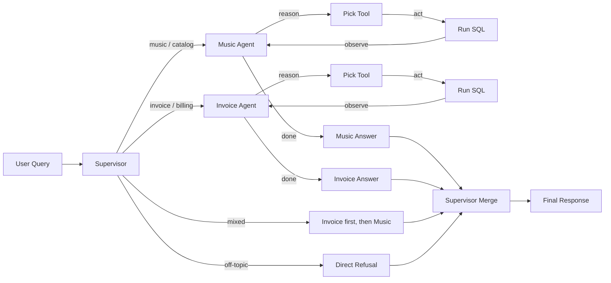
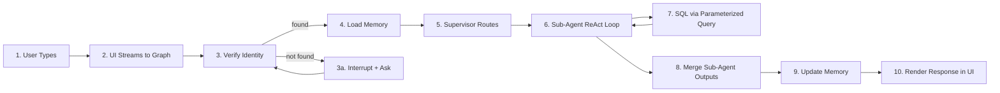
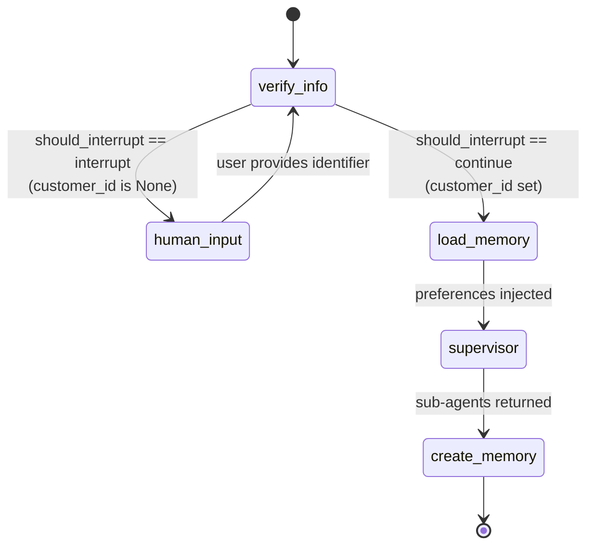
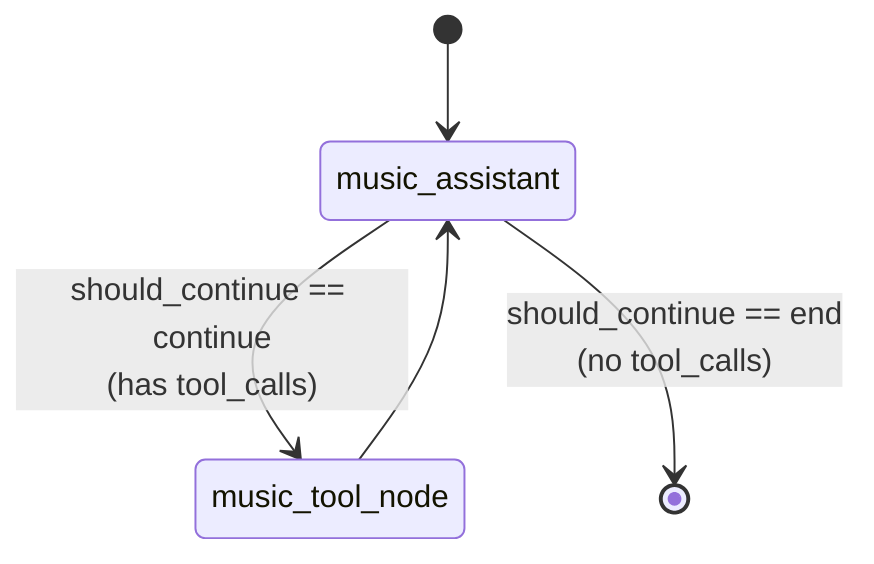
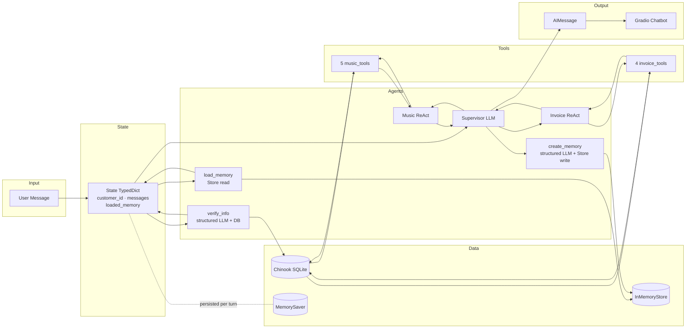
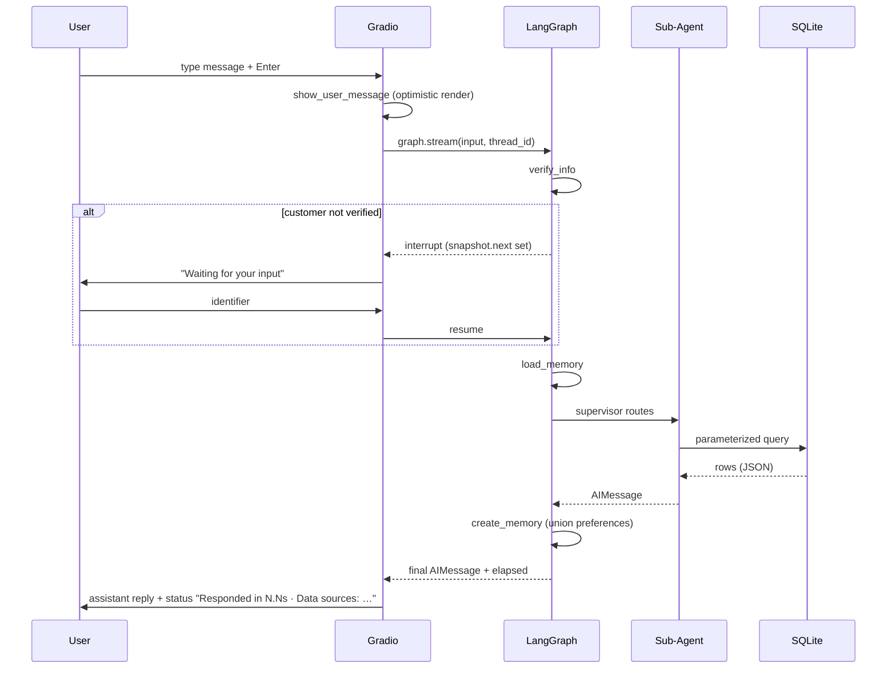

# Multi-Agent Customer Support System

A production-grade, **LangGraph-powered hierarchical multi-agent assistant** for a digital music store. It combines a **Supervisor router**, two specialized **ReAct sub-agents** (music catalog + invoice information), **human-in-the-loop identity verification**, **long-term per-customer memory**, and a **Gradio chat UI** - all backed by a real relational schema (the Chinook sample database).

**Live Demo:** [huggingface.co/spaces/animeshkcm/Multi-Agent-Customer-Support](https://huggingface.co/spaces/animeshkcm/Multi-Agent-Customer-Support)

---

## Capstone Framing

This project is designed as an advanced AI engineering capstone, going beyond a simple agent or tool-calling demo. It represents a fully assembled multi-agent AI system incorporating structured state management, persistent memory, safety controls, deterministic execution, and real-world data integration. Each architectural decision such as grounding rules, memory merge semantics, supervisor-based routing, verification gating, and deterministic SQL generation directly addresses known failure modes observed in production-scale LLM systems.

### Problem Statement

Customer support for a catalog-and-billing business has two opposing requirements:

1. **Conversational flexibility** - customers ask in free-form natural language (“what's my most expensive track?”, “any rock albums from AC/DC?”).
2. **Operational correctness** - invoice totals, track IDs, and customer accounts must be exact, auditable, and access-controlled.

A single LLM with a single system prompt cannot satisfy both: it will either hallucinate when asked for unavailable data, or leak account data across customers, or route off-topic questions to SQL tools. This project solves that gap with a **hierarchical agent graph** where each responsibility is isolated into its own node.

### Business Use Case

A digital music store with **59 customers**, **412 invoices**, **3,503 tracks**, **275 artists**, and **25 genres** (Chinook dataset). The assistant supports three user journeys:

| Journey | Entry Point | Guardrails |
|---|---|---|
| **Catalog discovery** (anonymous) | Any music question | Tool-grounded only; no PII access |
| **Account lookup** (identified) | Customer ID, email, or phone | Human-in-the-loop verification before any invoice tool runs |
| **Personalized recall** (returning) | Verified customer | Music preferences persisted across sessions, merge-only, never deleted |

### Why This Matters for AI Engineers

The project exercises the full surface area an AI engineer ships in production:

- **Graph-native orchestration** (not a flat ReAct loop) with conditional edges, interrupts, and a supervisor router.
- **Typed shared state** (`TypedDict` + `add_messages` reducer) instead of ad-hoc dicts.
- **Structured LLM output** (Pydantic schemas) for identifier extraction and preference capture - no regex parsing of model text.
- **Prompt engineering as a contract**: every sub-agent prompt enforces explicit grounding, exact quoting, and scope boundaries.
- **Deterministic SQL under an LLM** (CTE + `ROW_NUMBER()`) so the same question returns the same answer.
- **Two memory modes**: short-term per-thread (`MemorySaver` checkpointer) and long-term per-customer (`InMemoryStore`).
- **Streaming execution** via `graph.stream(..., stream_mode="updates")` wired to a Gradio chat UI with live status and interrupt handling.

### Technical Complexity

| Dimension | What's hard | How it's solved |
|---|---|---|
| **Routing** | Music vs invoice vs mixed vs off-topic | `langgraph-supervisor` with explicit routing rules in the system prompt |
| **Identity** | Accept ID / email / phone in free text without trusting user-extracted IDs downstream | Pydantic `UserInput` + DB lookup; verified `customer_id` is injected via `SystemMessage` only |
| **Hallucination** | LLMs invent albums, prices, totals | Tool-only responses enforced in every prompt; "I could not find…" fallback wording is scripted |
| **Determinism** | `LIMIT 10` on a genre returns different artists each call | `ROW_NUMBER() OVER (PARTITION BY ArtistId ORDER BY TrackId)` CTE → stable sample |
| **Memory merge** | LLM summarization can erase prior preferences | Set-union on `music_preferences`; empty output is ignored if existing memory exists |
| **Interrupts** | Verification needs a second user turn without losing graph state | LangGraph `interrupt()` + thread-scoped checkpointer; UI reads `snapshot.next` to detect pause |
| **SQL safety** | LLM-driven inputs could inject SQL | 100% parameterized via SQLAlchemy `text()` bindings; `_safe_int()` on all numeric args |

### The Engineering Challenge

The hardest part was **not** building any one agent. It was composing them so:

1. The supervisor cannot bypass verification.
2. The music agent cannot read invoices.
3. The invoice agent cannot guess a customer ID from the conversation.
4. Memory writes cannot erase prior data.
5. The whole thing is observable (every tool call is logged with input and output length) and testable (28 pytest tests over tools + DB).

Those constraints are what turn "LLM + tools" into a **system**.

---

## System Architecture

### High Level System Architecture



### Agent Workflow



---

## Pipeline Overview

End-to-end lifecycle of a single user turn:



Each stage is implemented as a distinct LangGraph node. No stage can be skipped; no stage can run out of order. The checkpointer snapshots state after every node so an interrupt can resume exactly where it paused.

---

## LangGraph State Machine

The outer graph is a strict finite state machine. It always enters at `verify_info` and always exits via `create_memory`.



**Shared state** (`src/state.py`):

```python
class State(TypedDict):
    customer_id: Optional[str]
    messages: Annotated[list[AnyMessage], add_messages]
    loaded_memory: str
    remaining_steps: RemainingSteps
```

**Supervisor subgraph** (built by `langgraph-supervisor.create_supervisor`) dispatches to one of the sub-agents and merges their responses into `messages` via the `add_messages` reducer.

**Music sub-agent subgraph** (hand-built, `src/agents/graph.py`):



**Invoice sub-agent** is built via `langgraph.prebuilt.create_react_agent` - same pattern, wrapped for you.

---

## Data Flow



**Invariants:**

- Only `verify_info` writes `customer_id`. No sub-agent or tool mutates it.
- Only tools touch `DB`. Neither the supervisor nor the verifier executes SQL directly (except the targeted lookups in `verify_info`).
- `create_memory` only **unions** into `InMemoryStore`; deletions are not possible via this path.

---

## Technology Stack

| Layer | Technology | Version | Role |
|---|---|---|---|
| Language | Python | 3.12+ | Runtime |
| UI | Gradio | 5.29+ | Chat interface, streaming, interrupts |
| Agent Orchestration | LangGraph | 1.0+ | State machine, checkpointing, ToolNode |
| Supervisor | langgraph-supervisor | 0.0.20+ | Hierarchical routing |
| Prebuilt Agents | langgraph-prebuilt | 1.0+ | `create_react_agent`, `ToolNode` |
| LLM Integration | langchain-openai | 1.0+ | `ChatOpenAI` (any OpenAI-compatible API) |
| Core Framework | langchain + langchain-core + langchain-community | 1.0+ / 0.4+ | Messages, tools, SQLDatabase utility |
| Data Validation | Pydantic | v2+ | `UserInput`, `UserProfile` schemas |
| Database Engine | SQLAlchemy | 2.0+ | In-memory SQLite via `StaticPool` |
| Dataset | Chinook | - | Customers, invoices, tracks, albums, artists |
| Checkpointer | `langgraph.checkpoint.memory.MemorySaver` | - | Per-thread short-term state |
| Store | `langgraph.store.memory.InMemoryStore` | - | Per-customer long-term memory |
| Env Config | python-dotenv | 1.0+ | Loads `.env` |
| HTTP | requests | 2.31+ | One-shot SQL script fetch |
| Packaging | Docker | 3.12-slim | Reproducible deploy |
| Hosting | Hugging Face Spaces | - | YAML-frontmatter driven |

---

## Project Structure

```
Multi-Agent-Customer-Support/
├── app.py                       # Entry point (local + HF Spaces: module-level app for HF import)
├── Dockerfile                   # Python 3.12-slim, exposes :7860, runs app.py
├── requirements.txt             # Pinned min versions
├── .env.example                 # OPENAI_API_KEY, MODEL_NAME, TEMPERATURE, PORT
├── Chinook_Sqlite.sql           # Cached dataset (auto-downloaded if missing)
│
├── src/
│   ├── config.py                # Settings class; reads env, sets logging format
│   ├── state.py                 # LangGraph State TypedDict
│   ├── models.py                # Pydantic schemas: UserInput, UserProfile
│   │
│   ├── db/
│   │   └── database.py          # SQLAlchemy engine, run_query_safe, normalize_phone, verify_database
│   │
│   ├── tools/
│   │   ├── music_catalog.py     # 5 @tool functions (fuzzy SQL, deterministic sampling)
│   │   └── invoice.py           # 4 @tool functions (customer-scoped queries)
│   │
│   ├── agents/
│   │   ├── prompts.py           # All system prompts (supervisor, sub-agents, verification, memory)
│   │   ├── nodes.py             # Graph node functions: verify_info, human_input, load_memory, create_memory, music_assistant, should_continue, should_interrupt
│   │   └── graph.py             # build_graph(): assembles music subgraph, invoice ReAct, supervisor, outer graph
│   │
│   └── ui/
│       ├── app.py               # Gradio Blocks, stream handler, status bar, reset button
│       └── styles.py            # CUSTOM_CSS
│
└── tests/
    ├── conftest.py              # DB fixture (session-scoped)
    ├── test_database.py         # 11 tests: run_query_safe, normalize_phone, verify_database
    └── test_tools.py            # 17 tests: all 9 tool functions
```

**Key files to read in order when grokking the repo:**

1. `src/state.py` - the shared contract.
2. `src/agents/graph.py` - how the whole thing is wired.
3. `src/agents/nodes.py` - what each node does.
4. `src/agents/prompts.py` - the behavioral contract for every LLM call.
5. `src/tools/*.py` - the data surface.
6. `src/ui/app.py` - how streaming + interrupts are surfaced.

---

## Application Flow (Gradio UI)



Every browser session is assigned a UUID `thread_id` stored in `gr.State`. This scopes the checkpointer so concurrent users never see each other's turns. The "New Conversation" button just rotates the UUID.

---

## Pipeline Stages

Each node is a pure function over `State` (plus optional `store`/`config`). Stages in execution order:

### 1. `verify_info` - Identity Gate
- **Input:** `messages`, maybe existing `customer_id`.
- **If already verified:** no-op pass-through.
- **Else:** calls `llm.with_structured_output(UserInput)` to pull one identifier (ID / email / phone). Runs a parameterized SQL lookup:
  - numeric → `CustomerId =`
  - contains `@` → `LOWER(Email) =`
  - else → `normalize_phone()` compared against normalized DB phones.
- **If found:** writes `customer_id` and a `SystemMessage` announcing the verified ID.
- **If not found:** invokes a polite re-prompt LLM using `VERIFICATION_PROMPT`.

### 2. `human_input` - Interrupt
- Calls LangGraph `interrupt("Please provide input.")`. The UI receives this via `snapshot.next` and pauses the turn. When the user replies, the graph resumes and loops back to `verify_info`.

### 3. `load_memory` - Preference Hydration
- Reads `("memory_profile", customer_id)` from `InMemoryStore`.
- Formats as `"Music Preferences: rock, AC/DC, jazz"` and sets `loaded_memory`.
- The music agent's prompt interpolates this string so it can personalize without re-asking.

### 4. `supervisor` - Hierarchical Router
- Built via `langgraph_supervisor.create_supervisor`.
- Routing rules (encoded in `SUPERVISOR_PROMPT`):
  - music/catalog → `music_catalog_subagent`
  - invoice/purchase/billing → `invoice_information_subagent`
  - mixed → invoice first, then music
  - off-topic → direct refusal, no sub-agent invoked
- Merges sub-agent outputs into a single coherent response. Never adds information not present in sub-agent outputs.

### 5a. `music_catalog_subagent` - Hand-Built ReAct
- Custom `StateGraph` with two nodes: `music_assistant` (LLM with bound tools) and `music_tool_node` (`ToolNode(music_tools)`).
- Conditional edge `should_continue` loops until there are no `tool_calls` left.
- System prompt is generated per call via `generate_music_assistant_prompt(loaded_memory)` so preferences are fresh.

### 5b. `invoice_information_subagent` - Prebuilt ReAct
- Built via `langgraph.prebuilt.create_react_agent(llm, tools=invoice_tools, prompt=INVOICE_SUBAGENT_PROMPT, state_schema=State)`.
- Prompt explicitly tells it to use the **verified** `customer_id` from the `SystemMessage`, not any ID the user mentions.

### 6. `create_memory` - Preference Capture
- Summarizes last 10 messages.
- `llm.with_structured_output(UserProfile)` extracts **explicit** preferences.
- Unions with existing preferences; if the LLM returns empty but there are existing preferences, the write is **skipped** (never erases).
- Writes back to `InMemoryStore`.

---

## Getting Started

### Prerequisites

- Python **3.12** (Python 3.13 is blocked on HF Spaces because Python 3.13 removes `audioop`).
- An OpenAI API key *or* any OpenAI-compatible endpoint (Groq, Together, Azure OpenAI, LM Studio, Ollama…).
- Git.

### Quick Start

```bash
# 1. Clone
git clone https://github.com/ANI-IN/Multi-Agent-Customer-Support.git
cd Multi-Agent-Customer-Support

# 2. Virtualenv
python3.12 -m venv venv
source venv/bin/activate            # Windows: venv\Scripts\activate

# 3. Deps
pip install -r requirements.txt

# 4. Config
cp .env.example .env
# edit .env → set OPENAI_API_KEY

# 5. Run
python app.py
# → http://localhost:7860
```

**First-run chat script:**
```
> My customer ID is 5
> What AC/DC albums do you have?
> Show me my most expensive purchase.
> I love rock music.            # saved to memory
# ... restart the app, verify again as customer 5 ...
> What genres do you think I'd like?
```

### Sample Dataset

The app boots against the [Chinook sample database](https://github.com/lerocha/chinook-database), loaded into an in-memory SQLite instance via SQLAlchemy `StaticPool`. On first run it reads `Chinook_Sqlite.sql` from the repo root; if missing, it downloads and caches it.

| Table | Rows | Notes |
|---|---:|---|
| Customer | 59 | PII + `SupportRepId` FK to Employee |
| Employee | 8 | Support reps |
| Invoice | 412 | `CustomerId`, `InvoiceDate`, `Total` |
| InvoiceLine | 2,240 | Each row = one purchased track |
| Track | 3,503 | `AlbumId`, `GenreId`, `MediaTypeId`, `UnitPrice` |
| Album | 347 | `ArtistId` FK |
| Artist | 275 | - |
| Genre | 25 | - |
| MediaType | 5 | - |
| Playlist / PlaylistTrack | 18 / 8,715 | Not currently exposed as tools |

### Developer Commands

```bash
# Run app
python app.py

# Full test suite (28 tests)
pytest tests/ -v

# Only DB layer
pytest tests/test_database.py -v

# Only tools
pytest tests/test_tools.py -v

# Docker build + run
docker build -t music-support .
docker run -p 7860:7860 -e OPENAI_API_KEY=sk-... music-support

# Quick sanity check without the UI
python -c "from src.db.database import verify_database; print(verify_database())"
```

---

## Configuration

All configuration is env-driven. `src/config.py` loads `.env` once at import time.

| Variable | Required | Default | Purpose |
|---|---|---|---|
| `OPENAI_API_KEY` | yes | - | API key for the LLM provider |
| `OPENAI_API_BASE` | no | - | Override base URL for non-OpenAI providers |
| `MODEL_NAME` | no | `gpt-4o-mini` | Chat model name |
| `TEMPERATURE` | no | `0` | `0` = fully deterministic routing |
| `PORT` | no | `7860` | Gradio port |

### LLM Provider (Pick One)

The project uses `ChatOpenAI`, which speaks the OpenAI protocol. Any compatible provider works by setting `OPENAI_API_BASE`.

<details>
<summary><b>OpenAI (default)</b></summary>

```env
OPENAI_API_KEY=sk-...
MODEL_NAME=gpt-4o-mini
```
</details>

<details>
<summary><b>Groq</b></summary>

```env
OPENAI_API_BASE=https://api.groq.com/openai/v1
OPENAI_API_KEY=gsk_...
MODEL_NAME=llama-3.3-70b-versatile
```
</details>

<details>
<summary><b>Together AI</b></summary>

```env
OPENAI_API_BASE=https://api.together.xyz/v1
OPENAI_API_KEY=...
MODEL_NAME=meta-llama/Llama-3.3-70B-Instruct-Turbo
```
</details>

<details>
<summary><b>Azure OpenAI</b></summary>

```env
OPENAI_API_BASE=https://your-resource.openai.azure.com/
OPENAI_API_KEY=...
MODEL_NAME=your-deployment-name
```
</details>

<details>
<summary><b>Local (LM Studio / Ollama / vLLM)</b></summary>

```env
OPENAI_API_BASE=http://localhost:1234/v1
OPENAI_API_KEY=not-needed
MODEL_NAME=your-local-model
```
</details>

> **Tip:** The supervisor relies on the model following structured routing instructions. Models smaller than ~7B may degrade routing accuracy on mixed queries.

---

## Tools Reference

### Music Catalog Tools (`src/tools/music_catalog.py`)

| Tool | Signature | Returns |
|---|---|---|
| `get_albums_by_artist` | `(artist: str)` | Album rows, fuzzy `LIKE '%artist%'` |
| `get_tracks_by_artist` | `(artist: str)` | Total count + up to 20 full-detail tracks |
| `get_songs_by_genre` | `(genre: str)` | Total count + 1 track per artist (up to 10), deterministic via `ROW_NUMBER()` CTE |
| `check_for_songs` | `(song_title: str)` | Up to 10 full-detail matches on track name |
| `get_track_details` | `(track_id: str)` | Every column for one track including computed `SizeMB` |

### Invoice Tools (`src/tools/invoice.py`)

| Tool | Signature | Returns |
|---|---|---|
| `get_invoices_by_customer_sorted_by_date` | `(customer_id: str)` | All invoices DESC by date |
| `get_invoice_line_items_sorted_by_price` | `(customer_id: str)` | All purchased **tracks** (not invoices) DESC by unit price |
| `get_employee_by_invoice_and_customer` | `(invoice_id, customer_id)` | Support rep name / title / email |
| `get_invoice_line_items` | `(invoice_id, customer_id)` | Full track details for one invoice |

All tool inputs pass through `_safe_int()` for numeric args. All return values are either JSON-serialized row lists or a human-readable "not found" string. Empty results are never silently collapsed.

---

## Prompt Engineering & Anti-Hallucination

Grounding rules (applied to every sub-agent prompt in `src/agents/prompts.py`):

1. **Tool-only** - never answer from model memory; always call a tool first.
2. **Exact quoting** - no rounding, no estimating, no "about".
3. **Honest failures** - "I could not find that in our catalog." is the literal fallback.
4. **Scope boundaries** - each sub-agent explicitly refuses out-of-scope queries and defers.
5. **Truncation transparency** - when results are sampled (LIMIT), say so and include the total.
6. **No invented IDs** - the invoice agent is told to read the verified `customer_id` from the `SystemMessage`, not from user text.

Memory rules (`CREATE_MEMORY_PROMPT`):

- Only **explicit** statements count ("I love jazz" ✅; "Do you have jazz?" ❌).
- New preferences **merge** with existing (set union).
- If the LLM returns empty but prior preferences exist, **skip the write**.

---

## Security

| Threat | Mitigation |
|---|---|
| SQL injection | Every query uses SQLAlchemy `text(...)` with bound `:name` parameters. No f-strings or concatenation. |
| Cross-customer data leak | `customer_id` is set only by `verify_info` and passed via `SystemMessage`. Invoice tools require it as a typed parameter. |
| Hallucinated accounts | Verification looks up against the real `Customer` table; unknown IDs produce a polite retry prompt, not a pass-through. |
| Numeric crashes | `_safe_int()` wraps every numeric tool arg and returns a friendly error instead of propagating `ValueError`. |
| Phone format bypass | `normalize_phone()` strips non-digits (preserving `+`), so `+1 (555) 123-4567` matches `15551234567`. |
| Thread cross-talk | Gradio issues a UUID `thread_id` per session; the checkpointer is scoped to it. |

---

## Testing

**28 pytest tests**, all deterministic, all hit the real in-memory DB.

```bash
pytest tests/ -v
```

| File | Tests | Coverage |
|---|---:|---|
| `tests/test_database.py` | 11 | `run_query_safe` (happy path, params, empty, JSON shape), `normalize_phone` (intl, domestic, dashes, empty, None, `+` prefix), `verify_database` |
| `tests/test_tools.py` | 17 | All 5 music tools + all 4 invoice tools; found / not-found / invalid-id / determinism / DESC-date ordering |

Notable determinism check:

```python
def test_get_songs_by_genre_deterministic(self):
    r1 = get_songs_by_genre.invoke({"genre": "Rock"})
    r2 = get_songs_by_genre.invoke({"genre": "Rock"})
    assert r1 == r2
```

---

## Deployment

### Hugging Face Spaces

This README's YAML frontmatter is the HF Spaces config. Push the repo to a Gradio Space, set `OPENAI_API_KEY` in **Settings → Repository Secrets**, and HF builds and runs `app.py` automatically. Python is pinned to 3.12 (3.13 breaks `audioop` imports pulled in transitively).

### Docker

```bash
docker build -t music-support .
docker run -d \
  -p 7860:7860 \
  -e OPENAI_API_KEY=sk-... \
  -e MODEL_NAME=gpt-4o-mini \
  --name music-support \
  --restart unless-stopped \
  music-support
```

### Docker Compose

```yaml
services:
  music-support:
    build: .
    ports: ["7860:7860"]
    environment:
      - OPENAI_API_KEY=${OPENAI_API_KEY}
      - MODEL_NAME=gpt-4o-mini
      - TEMPERATURE=0
    restart: unless-stopped
```

---

## Troubleshooting

| Symptom | Cause | Fix |
|---|---|---|
| `ModuleNotFoundError: gradio` | Deps not installed | `pip install -r requirements.txt` |
| `ModuleNotFoundError: audioop` | Python 3.13 | Use Python 3.12 |
| `ImportError: HfFolder` | Old Gradio | `gradio>=5.29.0` |
| `TypeError: argument of type 'bool' is not iterable` | Gradio/client schema bug | `gradio>=5.29.0` |
| `OPENAI_API_KEY not set` | Missing `.env` | `cp .env.example .env` + edit |
| Downloads Chinook on every start | Cache file missing | First run caches it; subsequent runs read locally |
| Verification keeps failing | No matching customer | Try Customer ID `5` (known to exist); or a real Chinook email / phone |

---

## Roadmap

- Persistent storage: swap `MemorySaver` → `SqliteSaver`; swap `InMemoryStore` → Postgres- or Redis-backed store.
- Token streaming in the UI (currently streams at node-event granularity).
- Playlist and customer-profile tools (tables present, tools not yet exposed).
- Structured JSON logs with correlation IDs per `thread_id` + latency metrics.
- CI pipeline (GitHub Actions) running `pytest` on every PR.
- Per-session rate limiting at the UI boundary.

---

## License

MIT. See [LICENSE](LICENSE).

---

<div align="center">
  <sub>Built and maintained by <b>Animesh Kumar</b> · LangGraph · Gradio · Chinook</sub>
</div>
